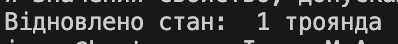

# Memento
Ідея знімка: 

зберігає стан об’єкта, щоб потім можна було повернути назад.

Як працює код: 

створюється “знімок” перед змінами, і при потребі відновлюється.

Навіщо: 

реалізація функцій “Undo”, “Скасувати зміни”.

## Код
```csharp
using System;

class Cart
{
    public string State { get; set; }
    public string Save() => State;
    public void Restore(string memento) => State = memento;
}

class Program
{
    static void Main()
    {
        var cart = new Cart();
        cart.State = " 1 троянда";
        string backup = cart.Save();

        cart.State = " 1 троянда, 1 тюльпан";
        cart.Restore(backup);

        Console.WriteLine("Відновлено стан: " + cart.State);
    }
}
```
## Результат

